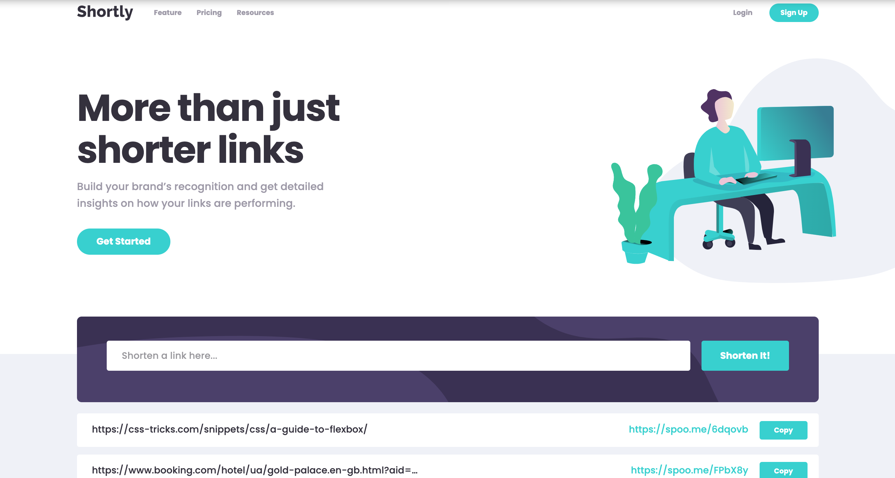

# Frontend Mentor - Shortly URL shortening API Challenge solution

This is a solution to the [Shortly URL shortening API Challenge challenge on Frontend Mentor](https://www.frontendmentor.io/challenges/url-shortening-api-landing-page-2ce3ob-G). Frontend Mentor challenges help you improve your coding skills by building realistic projects.

## Table of contents

- [Overview](#overview)
  - [The challenge](#the-challenge)
  - [Screenshot](#screenshot)
  - [Links](#links)
- [My process](#my-process)
  - [Built with](#built-with)
  - [What I learned](#what-i-learned)
- [Author](#author)

## Overview

### The challenge

Users should be able to:

- View the optimal layout for the site depending on their device's screen size
- Shorten any valid URL
- See a list of their shortened links, even after refreshing the browser
- Copy the shortened link to their clipboard in a single click
- Receive an error message when the `form` is submitted if:
  - The `input` field is empty

### Screenshot

### Links

- Solution URL: [Add solution URL here](https://github.com/Kulya1986/fm_project15_url_shortening_api)
- Live Site URL: [Add live site URL here](https://your-live-site-url.com)

## My process

### Built with

- Semantic HTML5 markup
- Flexbox
- CSS Grid
- Mobile-first workflow
- [React](https://reactjs.org/) - JS library
- [Tailwind](https://tailwindcss.com/) - A utility-first CSS framework

### What I learned

I've improved usage of Tailwind utility class for styling elements. Also widely introduced custom utility classes, including ones for animation required in application.

Also I've learned how use Navigator.clipboard for application customization.

## Author

- Website - [Nataliia Kulyk](https://portfolio-page-sthy.onrender.com)
- Frontend Mentor - [@Kulya1986](https://www.frontendmentor.io/profile/Kulya1986)
- LinkedIn - [Nataliia Kulyk](https://www.linkedin.com/in/nataliia-kulyk-7305a5240/)
